# Secure Private Cloud Storage on Azure — OwnCloud Deployment

A 2-tier secure architecture on Microsoft Azure, built manually through the Azure Console to replace an insecure Dropbox-based file-sharing workflow with a self-hosted, access-controlled alternative — completed as part of Great Learning's PGP in Cloud Computing program.

> **Where this fits in my learning path:** this was one of the first hands-on cloud projects I built — entirely through the Azure Console, with no Terraform or any Infrastructure-as-Code involved. I did this deliberately before picking up IaC tools: I wanted to actually click through and understand what a virtual network, a subnet, a NAT gateway, and a security group *are* and *do* before automating the creation of any of them. That foundation is what made later Infrastructure-as-Code projects (see [TemsFidelity Bank](https://github.com/love4jeme/temsfidelitybank)) click much faster — when Terraform creates a `kubernetes.io/cluster` subnet tag or a security group ingress rule, I already understood exactly what that resource does and why it's configured that way, because I'd built the equivalent by hand first.

---

## The Problem

The scenario: a company's employees were using Dropbox to share files internally and externally. According to the brief, 40–75% of employees at similar businesses use unsanctioned file-sharing tools like this, and roughly half of Dropbox users do so despite knowing it violates policy. The average cost of a resulting data breach: **$5.5 million**. The task was to design and deploy a private, access-controlled alternative that keeps sensitive company and customer data inside infrastructure the company actually controls.

---

## Architecture Diagram

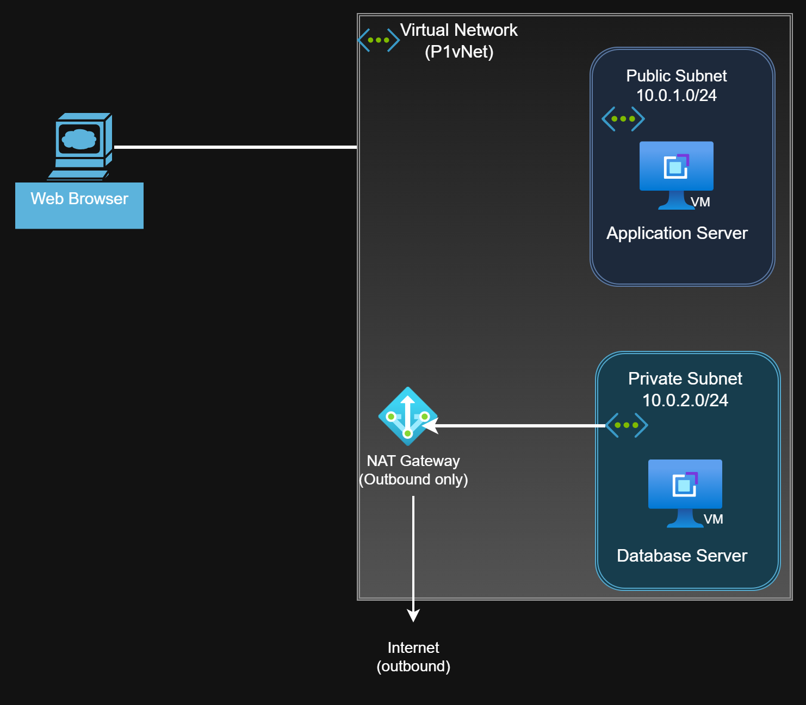

---

## Architecture

**2-tier design: Application tier (public) + Database tier (private)**

| Layer | Component |
|---|---|
| Virtual Network | P1VNET — 10.0.0.0/16 |
| Public Subnet | 10.0.1.0/24 — hosts the Application Server |
| Private Subnet | 10.0.2.0/24 — hosts the Database Server, no public IP |
| Application Server | Ubuntu 22.04 VM, running Apache + OwnCloud |
| Database Server | Ubuntu 22.04 VM, running MySQL, **no public IP** |
| NAT Gateway | Lets the private subnet reach the internet (e.g. for package installs) without being reachable from it |
| Network Security Groups | `AppNSG` (ports 22, 80) and `DbNSG` (ports 22, 3306 — internal-only) |

**Why this design:**
- The database server has **no public IP at all** — it can only be reached from within the virtual network, closing off the most common attack path (direct internet access to a database).
- The NAT Gateway gives the private subnet outbound-only internet access, so the database server can still pull software updates without being directly exposed.
- Two separate Network Security Groups scope exactly which ports are reachable and from where, rather than relying on a single shared security boundary.
- OwnCloud itself replaces Dropbox with a private, self-hosted file-sharing platform — the company's data never leaves infrastructure it controls.

---

## What Was Built

1. **Virtual network and subnetting** — created P1VNET with segmented public and private address spaces.
2. **NAT Gateway** — provisioned and attached to the private subnet for controlled outbound access.
3. **Network Security Groups** — `AppNSG` and `DbNSG`, each scoped to only the ports each tier actually needs.
4. **Application Server** — Ubuntu 22.04 VM in the public subnet; installed OwnCloud and its PHP/Apache dependencies via SSH.
5. **Database Server** — Ubuntu 22.04 VM in the private subnet; installed and configured MySQL via a provided install script, reached only through the Application Server as a jump point.
6. **Verification** — confirmed the deployment by accessing OwnCloud's setup page over the Application Server's public IP in a browser.

---

## Verified Proof

**Virtual Network provisioned (P1VNET, East US)**
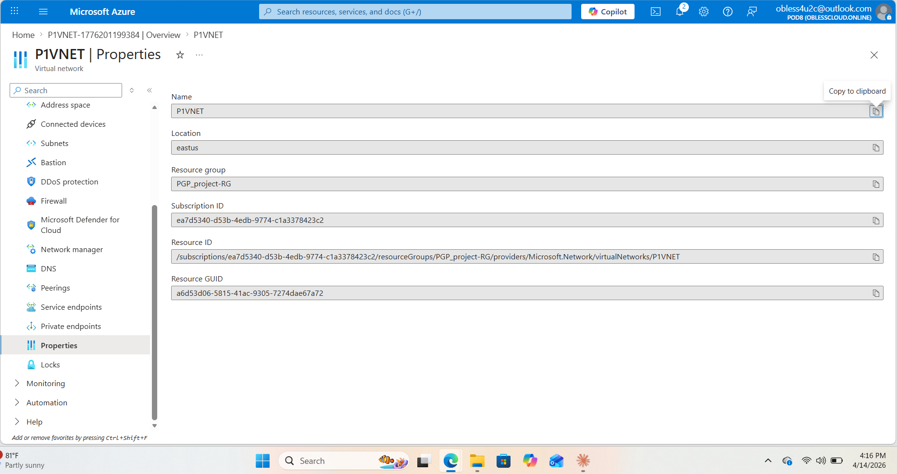

**Public and private subnets segmented**
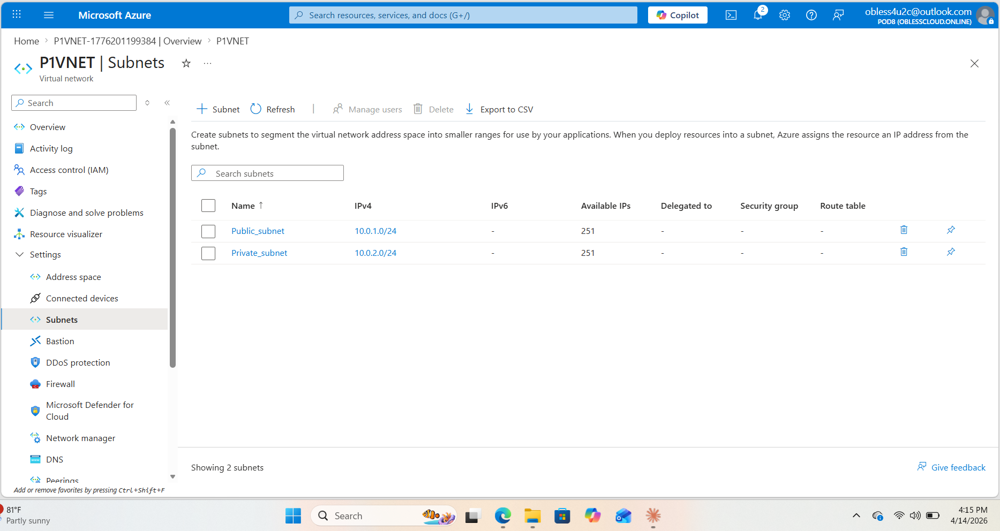

**NAT Gateway attached to the private subnet**
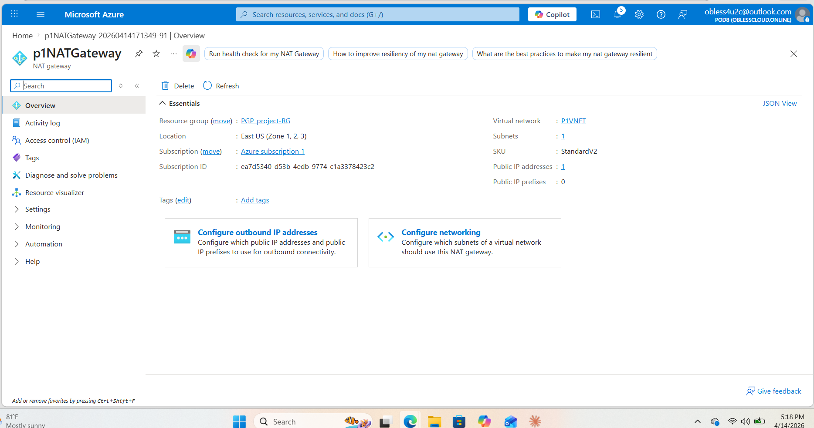

**AppNSG — SSH and HTTP only**
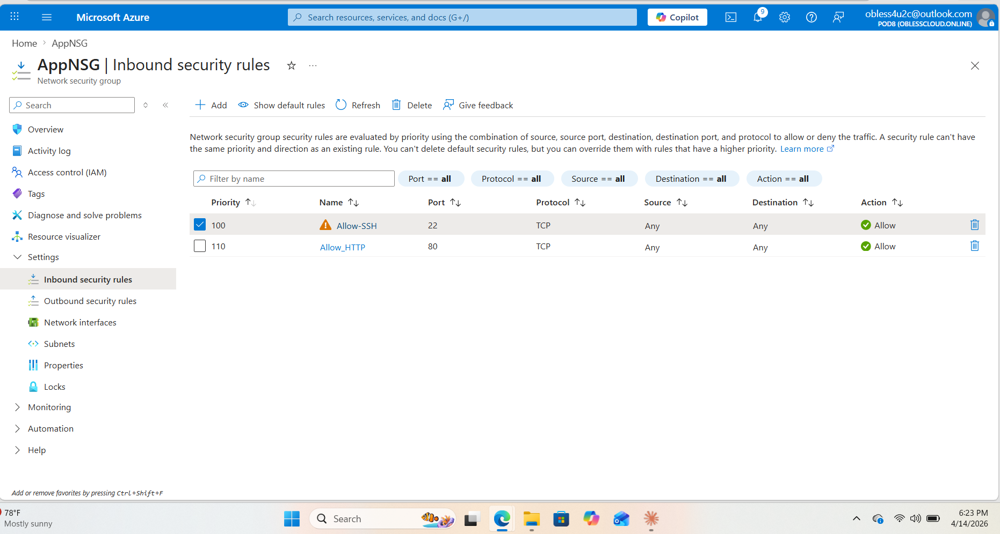

**DbNSG — SSH and MySQL only, no public exposure**
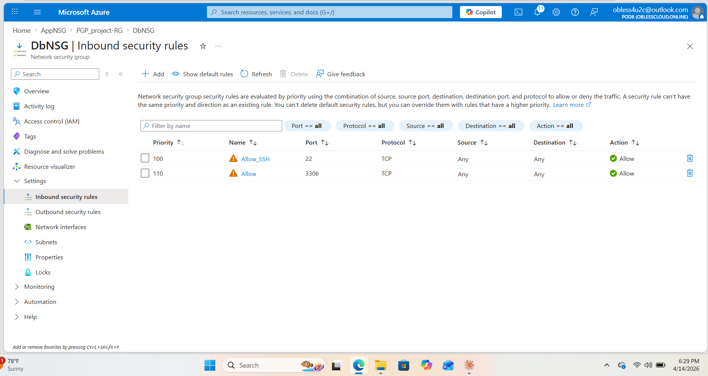

**Application Server — public IP, in the public subnet**
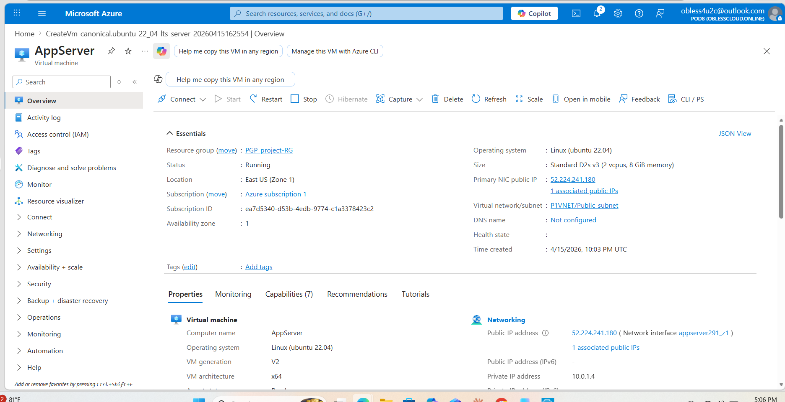

**Database Server — no public IP, in the private subnet**
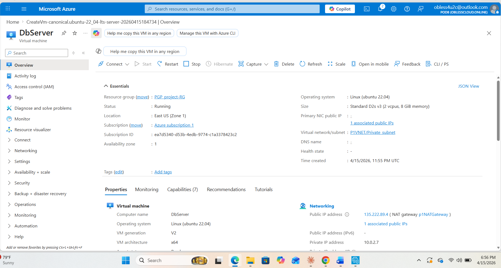

**MySQL installed on the database server via SSH**
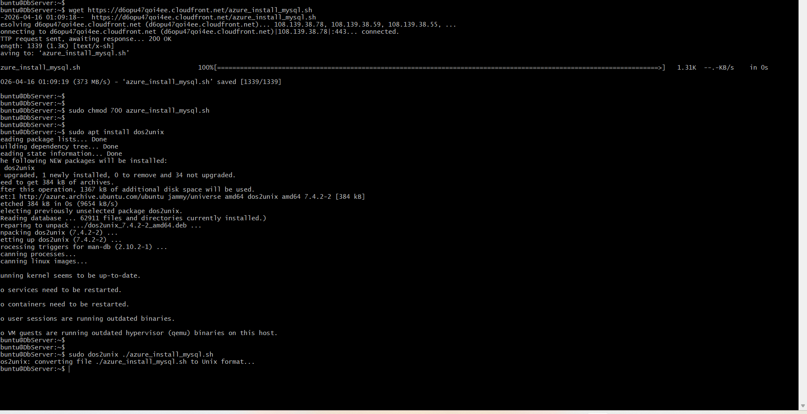

**OwnCloud downloaded, extracted, and permissions configured**
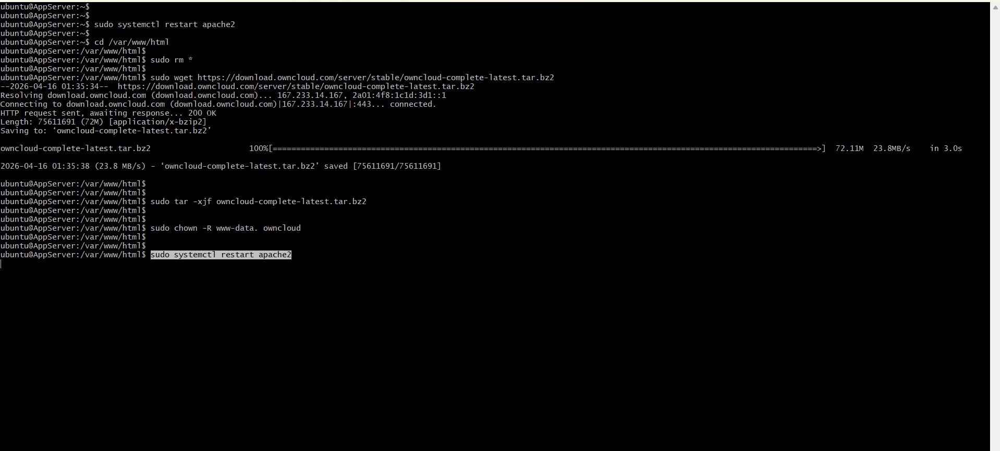

**OwnCloud setup page live in the browser, via the Application Server's public IP**
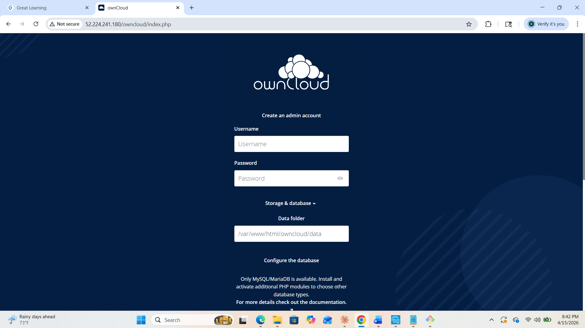

---

## From Console to Code

Everything in this project — the VNet, subnets, NAT Gateway, NSGs, VM provisioning — was created by hand, one Azure Console screen at a time. That hands-on repetition is what later made Infrastructure-as-Code genuinely click: when I started writing Terraform for [TemsFidelity Bank](https://github.com/love4jeme/temsfidelitybank) (a similarly-shaped VPC/subnet/security-group architecture, on AWS), I wasn't learning what a NAT Gateway or a security group *was* for the first time — I was learning how to *express* something I already understood, in code instead of clicks. That's also why I could catch and fix real Terraform/reality mismatches in that later project (like a security group referencing the wrong database port) — I knew what the correct running configuration was supposed to look like, independent of what the code said.

---

## Program

Completed as part of the **Post Graduate Program in Cloud Computing**, Great Learning (in partnership with Texas McCombs).
